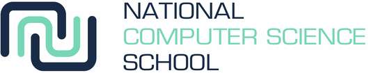

# ncss-cyber

Within this repository are the files and resources used by me and/or created by me for the National Computer Science School (NCSS) Summer School, 2023.
This repo is simply a store for me to upload code and resources from the LAB computers allowing me to access these resources after the course, for further reference.

If you are interested in learning more, feel free to contact me using my [personal email](mailto:jamescoates06@gmail.com) or by using one of my [business accounts](mailto:james@portfoliopro.au)
*** 

**Please note:** All files located within this repository are owned by James Coates, and any unauthorsed use of this repository is **strictly** prohibited. 
Should you wish to use a sample of my code or images and use it to your monetary benefit, please contact me by using the emails listed above.
